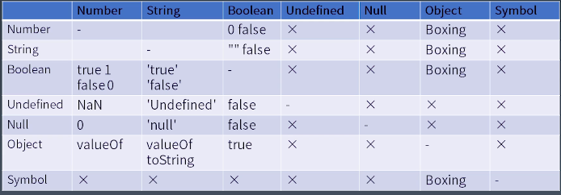

# 课堂笔记

# 1. JS表达式 | 运算符和表达式

## javescript整个流程
- Atom（原子）
- Expression（表达式）
- Statement（语句）
- Structure（结构）
- Program/Module（程序/模块）

从最小的单位逐渐构造成一个完整的语言。

## Atom

- Grammar
    - Grammar Trees vs priority（优先级）
    - Left hand side & Right hand side（左值和右值）
- Runtime
    - Type Convertion（类型转换）
    - Reference（参考文献）

上周是基本类型，这周是稍微大一点的结构：表达式。就是流程里的第二部分。

这节是语法树和运算符优先级的关系，以及运算符的左值和右值的区别。

小学学四则运算，就知道乘除的优先级比加减高，这一习惯怎么来的，先不做追究和质疑，但是事实就是这样。如果你实在想改变它们的运算顺序，可以加括号，可见括号的优先级比乘除高。所以我们去构造一棵语法书的时候，必须要考虑的因素。

乘除会优先形成更小一级的语法结构，加减会形成更高一级的语法结构。比如1+2*3，会大概形成如图语法树：

winter老师说这他颗树画并不严谨，它并不是一个抽象语法树，而是一种所谓中辍树，但是它可以表达优先级会影响语法树的构成。

在js的标准中，它是用产生式来描述运算符的优先级的。

## Expressions（下面按照优先级排序）

### Member
- a.b
- a[b]
- foo `string`
- super.b
- super['b']
- new.target
- new Foo()

### New
- new Foo

### Call（函数调用）
- foo() （最基础的一个Call Expression，优先级低于new，同时低于前面所有的Member运算）
- super()
- foo()['b']
- foo().b
- foo()`abc`
### Left hand side & Right hand side

### Update
- a++
- a--
- --a
- ++a

### Unary（单目运算）

- delete a.b
- void foo()   （vold 运算符的作用是把后面不管什么东西都给它变成underfind，看似没用，其类似于我们的空白，回车，它可以起到很好的改变语法结构的作用，也不能说完全没有用）
- typeof a
- +a （正号其实并不会改变后面表达式的值，当然如果后面是一个字符串的话，它就会发生一些类型转换）
- -a
- ~a    （位运算，把一个整数按位取反，如果不是整数，就强制转为整数）
- !a    （非运算，针对布尔值的运算，有时候会用两个叹号把一个数字或任何类型的树，强制转换成布尔类型）
- await a  （有点复杂，会对后续语法更大的一些语法结构造成较大的影响）

其实大部分的运算它都会发生一些类型转换，表达式可以说是类型转换大户和和重度用户。

### Exponental （乘方）

- **

是js唯一个右结合的运算符。比如 3**2**3，会先计算2的3次方，然后再计算3的8次方。

### multiplicative
- */%
### Additive
- +-

js 中其实就2中加法，一种是字符串相连，一种是数字相加，设计成同一种加号其实是比较容易混淆的。所以加法的类型转换比较复杂。
### Shif
- << >> >>>
### Relationship
- <> <= >= instanceof in

## Equality
- ==
- !=
- ===
- !==

## Bitwise
- & ^ |

## Logical
- &&
- ||

## Conditional 
- ?:

Conditional 运算符是唯一一个三目运算符。
但前面执行为true的时候，它的冒号的后半部分是不会被执行的。所以某种意义上也可以代替if和else

Logical 和 Conditional都是有短路逻辑的，不能保证写在这个结构里面的所有的表达式子结构都被执行。其他的表达式结构都没有这个类型。

         
# 2. JS表达式 | 类型转换

a+b一定是要作用于字符串或者数字之间，如果a和b是别的类型，那就要发生类型转换。

如果，字符串+数字，那么这个数字就会转换为字符串。

如果其中一个是布尔类型，则要根据相加的关系进行转换。

对于表达式来说，类型转换也是一个重要的基础设施。

js里面最复杂的类型转换就是 "=="（双等号）,类型相同它可以比较，类型不同，它基本上是把它全转为Number，然后再比较。所以：
    
- 你敲个空格和false比较，为true
- "false" == false, 为false
- 0 == false，为true

很违背人类直觉，所以这块也被认为是js设计初期最大的的一个失误，这是一个公认的结论，包括js的作者Brendan Eich都对此有过发言确认的。这种历史包袱，我们也没有办法去推翻。

所以推荐大家尽量使用"==="（三等号），或者做完类型转换再进行比较。这样就避免一些不必要的麻烦。

Member Expression里面的Object key的部分，它也会发生类型转换。这都一些表达式中类型转换的例子。像位运算不但要转换成Number类型，还必须要把Number类型再转换为整数类型。这就是类型转换对我们表达式的意义。

## 不同类型之间的互相转换

- object转成Number的时候，会调用valueOf成员函数。

## UnBoxing
拆箱转换，就是把一个Object转成一个基本类型。这里面做主要的一个过程叫ToPremitive，ToPremitive发生在我们的表达式定义的方方面面：

比如说Object + Object或者Object参与运算的情况，都会调用ToPremitive过程。

## boxing

# 3. JS语句 | 运行时相关概念

## Statement

- Grammar
    - 简单语句
    - 组合语句
    - 声明
- Runtime
    - Completion Record（语句执行的一个结果的记录）
    - Lexical Environment（作用域）
         
# 4. JS语句 | 简单语句和复合语句

## 简单语句

- ExpressionStatement（表达式语句，最核心，真正的驱动，计算机完成计算）
- EmptyStatement（单独的一个分号就是空语句，无卵用，只是从语言完备性来讲允许它存在）
- DebuggerStatement
- ThrowStatement（流程控制）
- ContinueStatement（流程控制）
- BreakStatement（流程控制）
- ReturnStatement（流程控制）
  
其实整个js语言就是这个作用，让计算机完成计算，并且完成一定的流程控制。

## 复合语句

- BlockStatement（最重要，是完成树状结构最重要的基础设施）
- IfStatement
- SwitchStatement（switch，winter老师不建议在js中使用，在c++或c里边性能比连续if要高，在js中没有区别）
- IteationStatement（包含，while、do-while、for、for await）
- WithStatement（广受诟病的一个表达式，它可以通过with打开一个对象，然后把对象所有属性直接放进作用域里边，写法上节约空间，也可以节约一些记忆成本，但实际上本身带来的不确定性非常的高，所以在现代js编程规范中拒绝使用）
- LabelledStatement（可以在语句前面加个label，相当于给语句起个名字）
- TryStatement

# 5. JS语句 | 声明

- FunctionDeclaration
- GeneratorDeclaration
- AsyncFunctionDeclaration
- AsyncGeneratorDeclaration
- VariableStatement
- ClassDeclaration
- LexicalDeclaration
         
# 6. JS结构化 | 宏任务和微任务

- 宏任务
- 微任务（promise）
- 函数调用（Execution Context）
- 语句/声明（Completion Record）
- 表达式（Reference）
- 直接量/变量/this

宏任务和微任务的区分采用了jsc的说法，在不同的js引擎里的说法也会有区别。
宏任务就是传给js引擎的任务。微任务就是在js引擎内部的任务。
宏任务在js语言中是最大粒度的这样一个范围。

在js中，只有promise会产生微任务。微任务里边可能会分成几个函数调用。

         
# 7. JS结构化 | JS函数调用

# 本周作业

## 1、StringToNumber和NumberToSting函数实现

StringToNumber：上一节课提到，Number有4中进制的定义，StringToNumber就是能够去解析这4中类型的String，让后把它变成Number。

NumberToSting：就是一个逆向的过程，可以通过传一个进制来制定它到底要转换成几进制的字符串。

上周提到：

Number的语法在2018的标准里，它分为4个部分
- 1、十进制表示
    - 0
    - 0.
    - .2
    - 1e3（代表1000）
- 2、二进制表示（以0b开头，且后面只能写0或1，不能有空格）
    - 0b111
- 3、八进制表示（以0o开头，且后面只能写0~7）
    - 0o10
- 4、十六进制表示（以Ox开头，可以写0~9的数字，A~F表示10~16的值）
    - 0xFF

